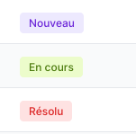
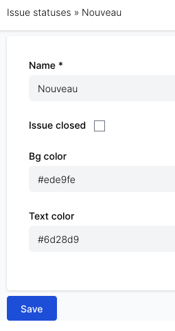

# Issue statuses

## What can you do?

You can customize the background color and the text color of the issue statutes.

Example :

## How can you do that?

You need administrator privilege to customize the colors.
Go to admin area > Issue statuses
(direct link : redmine_url/issue_statuses)

Click on a status and change the Bg color & Text color fields
(Here is an example of a color palette : https://tailwindcss.com/docs/customizing-colors)

