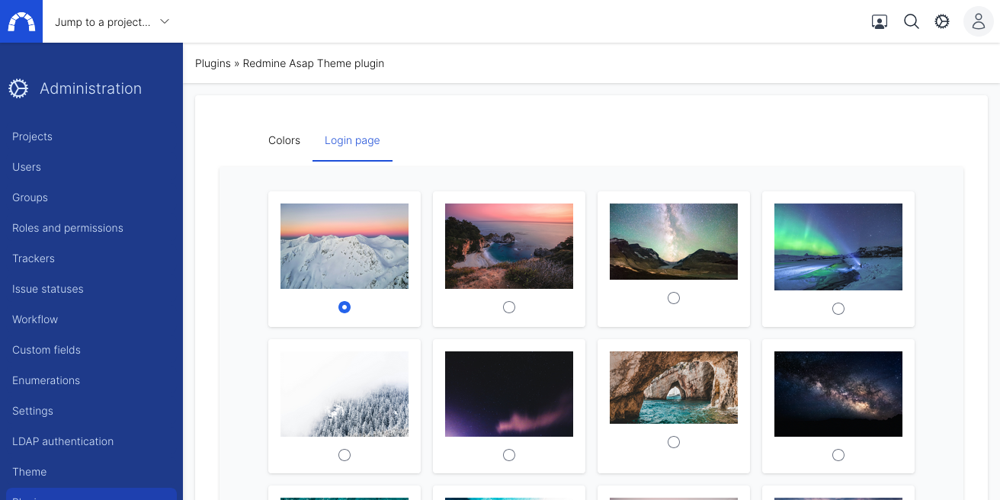

# Login page

## What can you do?

You can customize the background image of the login page by choosing a wallpaper in a predefined list of images.

## How can you do that?

You need administrator privilege to customize the login page.
Go to admin area > theme and then select the tab `login page`
(direct link : redmine_url/settings/plugin/redmine_asap_theme?tab=asap_theme_login)

Select the image you want

Click on apply and that's it!