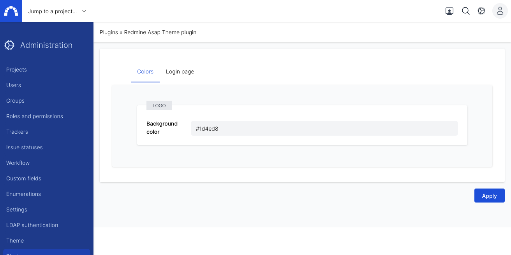

# Logo

## What can you do?

You can customize the background color of the logo in the left top corner.

## How can you do that?

You need administrator privilege to customize the login page.
Go to admin area > theme
(direct link : redmine_url/settings/plugin/redmine_asap_theme)

Fill the field background-color with hexadecimal color code

Click on apply and you will see the result on the top left corner.