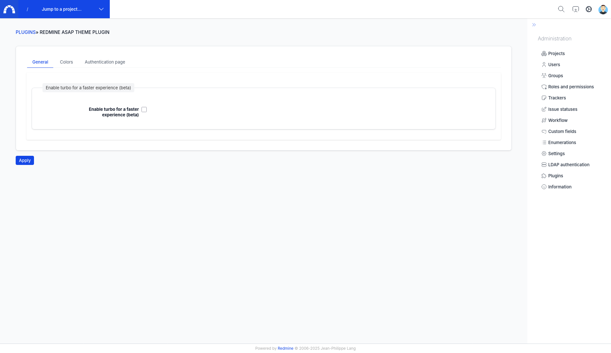

# General settings

## Turbo

https://turbo.hotwired.dev/handbook/introduction

Turbo can be enable from the plugin administration page. It improves performances but has some drawbacks and specially with legacy javascript so use it as your own risk, it might not be fully compatible by now.

