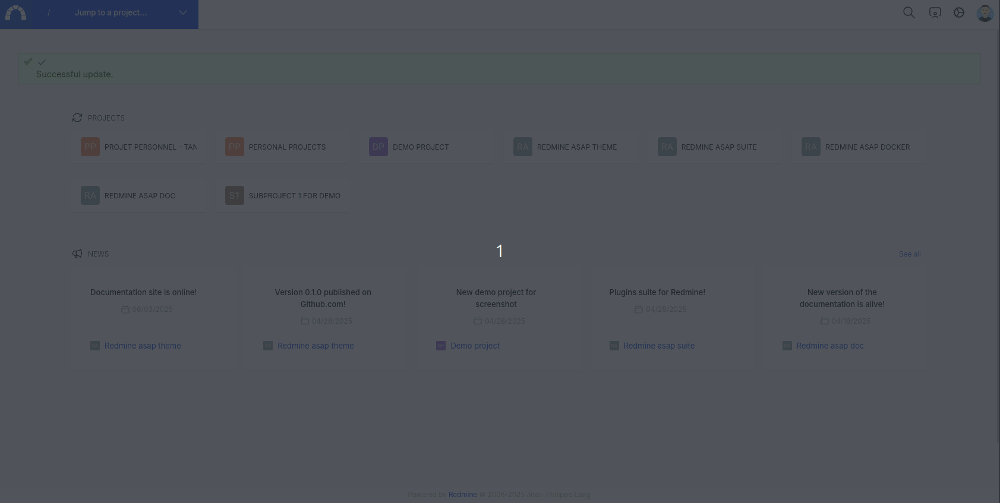

# Inbox

The purpose of this feature is to display a user's issues in the form of a mail-like inbox. The page is divided into three columns: the left column to display the queries, the middle one for the list of issues, and the right one for the details of an issue.

The comment addition form has been integrated directly into the right column to quickly add a note.

## Issues assigned to me

First query shows issues assigned to me

## Watched issues

Give the list of watched issues the same way as the inbox.

