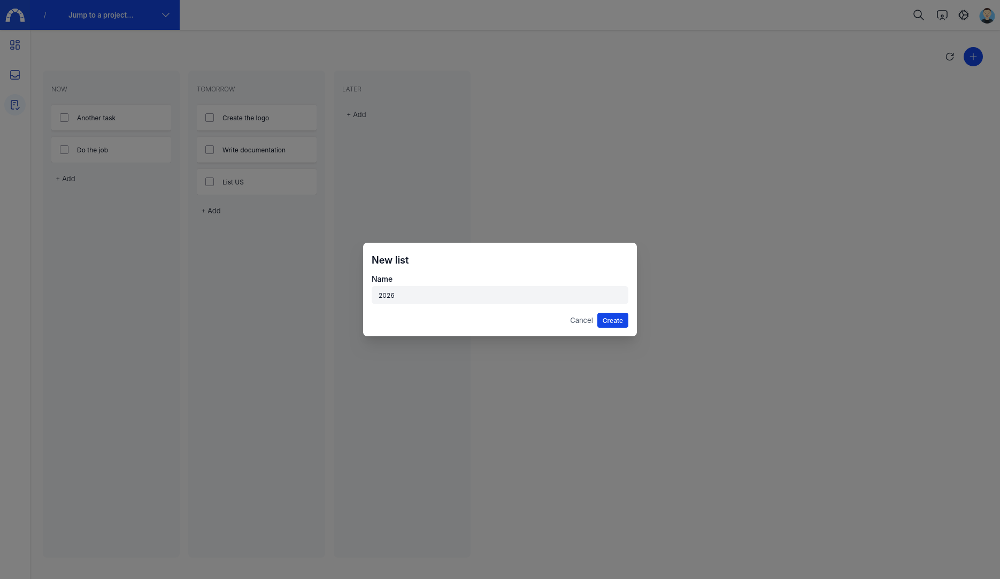

# Todo

The purpose of this feature is to provide users with a personal task manager similar to a to-do list. Users can create columns and tasks directly within a column. They can mark a task as completed by checking the box and move a task by dragging and dropping it into the column of their choice.

## Features

* Add a list (version from a project point of view) and manage it (edit/delete)
* Add issue
* Drag and drop issues from one column to another one
* Finish an issue quickly with the checkbox

## Create a list

## Add quickly an issue

Drag and drop issues

